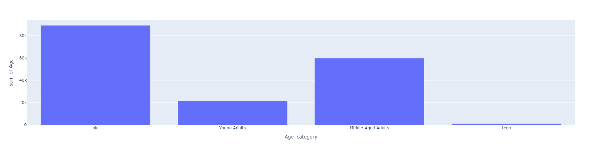
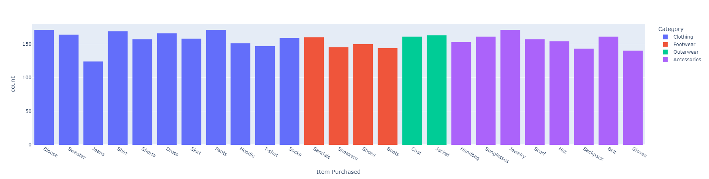
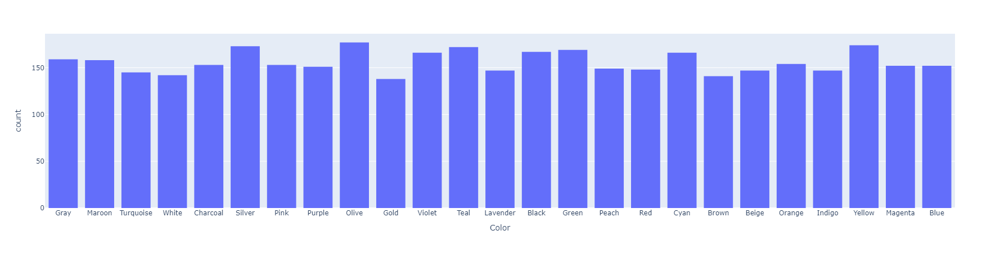

# Identifying Shopping Trends Using Data Analysis

This project explores how advanced data analysis techniques can uncover shopping trends, predict future consumer behavior, and provide actionable insights for businesses. By analyzing datasets from various e-commerce and retail sources, this study aims to empower strategic decision-making in the retail sector.

## Objectives

- Identify popular products based on shopping patterns.
- Analyze seasonal buying behaviors and demographic preferences.
- Investigate correlations between shopping trends and external factors (e.g., holidays, promotions, economic conditions).
- Deliver actionable insights for inventory management and marketing optimization.

## Methodology

The project methodology involves:

1. **Data Preprocessing**: Cleaning and preparing datasets for analysis.
2. **Exploratory Data Analysis (EDA)**: Identifying patterns and correlations in the data.
3. **Machine Learning Models**: Predicting future trends and deriving insights.
4. **Visualization**: Presenting findings through clear and interactive visualizations.

## Tools and Technologies

- **Programming Languages**: Python
- **Libraries**: Pandas, NumPy, Matplotlib, Seaborn, Scikit-learn
- **Other Tools**: Jupyter Notebook

## Key Findings

- Shopping trends are influenced by external factors like holidays, promotional events, and economic conditions.
- Seasonal buying patterns are prominent in specific product categories.
- Demographic preferences play a significant role in product popularity and sales trends.

## Results

The project concludes with actionable insights for businesses, including recommendations for optimizing inventory management, targeted marketing strategies, and adapting to dynamic consumer demands.

## How to Use

1. Clone the repository:

   ```bash
   git clone https://github.com/shekharP1536/Identifying-Shopping-Trends-using-Data-Analysis.git
   ```

2. Install dependencies:

   ```bash
   pip install -r requirements.txt
   ```

3. Run the project:  
   Open the Jupyter Notebook and follow the step-by-step analysis.

## Contributing

Contributions are welcome! Feel free to open issues or submit pull requests to improve this project.
## Preview of projects



## Acknowledgments

This project was completed as part of the **AICTE Internship on AI: Transformative Learning** in collaboration with **TechSaksham – A Joint CSR Initiative of Microsoft & SAP**.

---

Let me know if you'd like to tweak any specific section or add links/files!
"# shopping-trends-analysis" 
